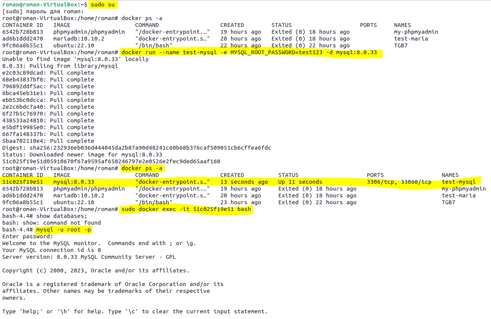
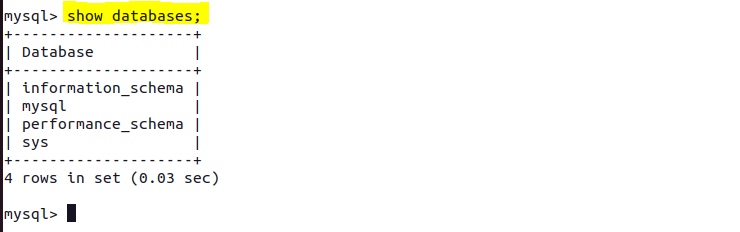
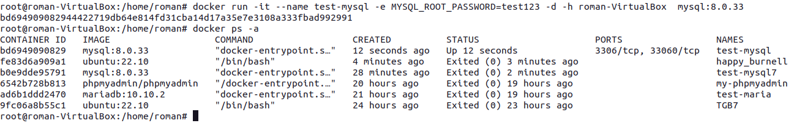
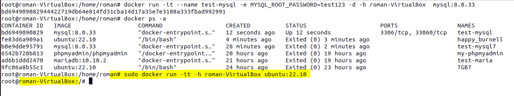
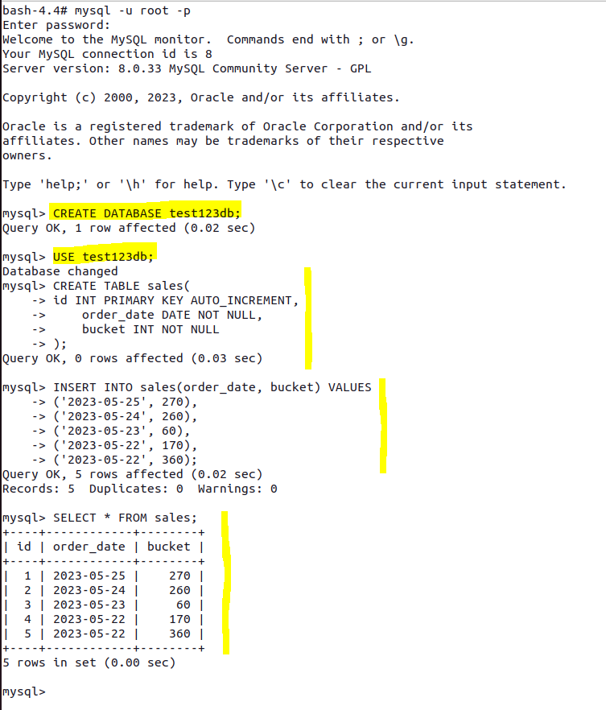
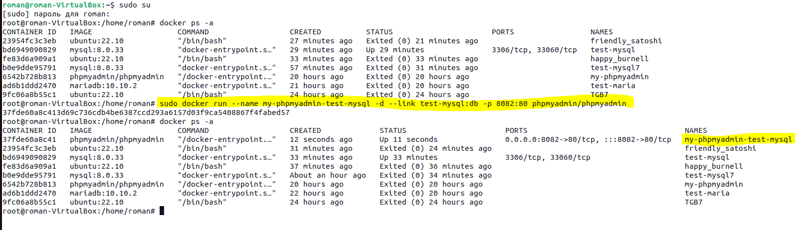
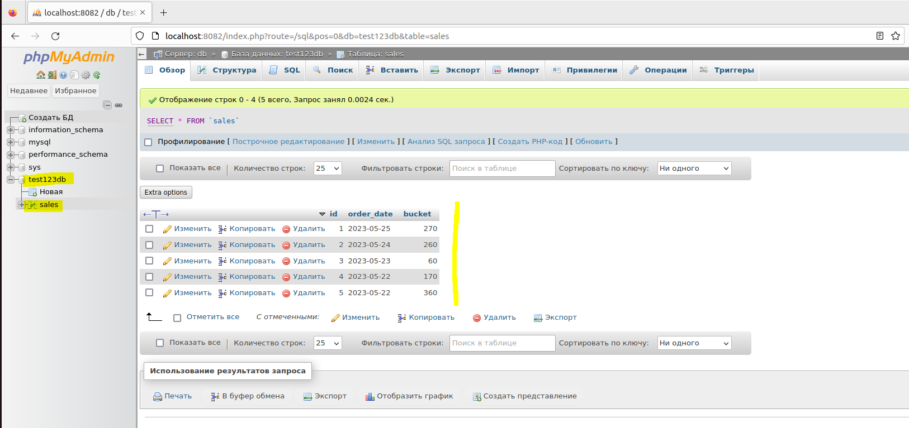

# Урок 3. Введение в Docker
## Classwork
Знакомились с работой Docker.
## Homework
### Задание:
1) запустить контейнер с БД, отличной от mariaDB, используя инструкции на сайте: https://hub.docker.com/;
2) добавить в контейнер hostname такой же, как hostname системы через переменную;
3) заполнить БД данными через консоль;
4) запустить phpmyadmin (в контейнере) и через веб проверить, что все введенные данные доступны.

**Решение**
1) Запустить контейнер с БД, отличной от mariaDB, используя инструкции на сайте: https://hub.docker.com/

2) Добавить в контейнер hostname такой же, как hostname системы через переменную:

Для наглядности:

3) Заполнить БД данными через консоль:

4) Запустить phpmyadmin (в контейнере) и через веб проверить, что все введенные данные доступны:

*Подготовил студент GeekBrains* [**`Костиков Роман`**](https://gb.ru/users/d0da3e74-94c9-4467-a23e-2ee70d85dcdc), 
Seminar_3_containerization
